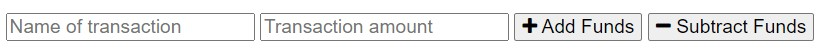
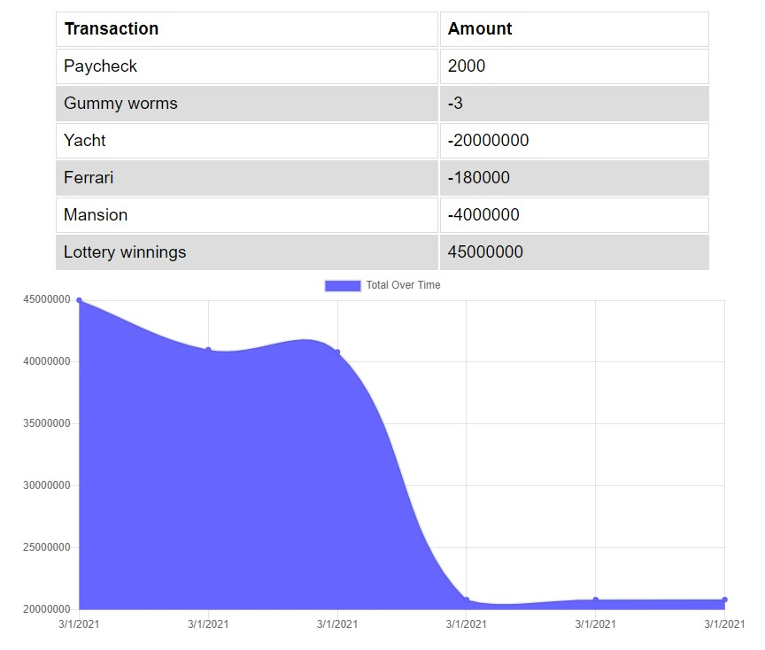

# Budget Tracker

[](https://opensource.org/licenses/MIT)


## Description
A budget tracker that can be used both online and offline using indexedDB and service workers.


## Table of Contents
  
  * [Installation](#installation)
  * [Testing](#testing)
  * [Useage](#useage)
  * [Technologies](#technologies)
  * [License](#license)
  * [Contact](#contact)
  * [Links](#links)


## Installation

'git clone' from [my repository](https://github.com/TimMartin13/budget-tracker) and then open the terminal window and navigate to the folder that holds the server.js file. Run

```
npm i
```
to install the all of the dependancies. Then type

```
node server.js
```
into the terminal window.  Open your localhost to 3001 and have fun.


## Useage
The easy way: click on the Heroku link in the Links section of this document, then add a Name of the transaction, an amount, and whether that adds funds or subtracts them:



Your transaction will be added to the table and the graph whether you are online or offline:



Your balance is shown at the top of the screen:


## Testing

Vigorously, manually tested with various transactions.


## Technologies

JavaScript, node.js, npm packages(express, nodemon, mongoose, morgan), HTML, CSS, MongoDB, Heroku, MVC model, IndexedDB, Service workers. 


## License

Licensed under the [MIT](https://choosealicense.com/licenses/mit/) license 


## Contact

Email: timmartin13@gmail.com

Github: [TimMartin13](https://github.com/TimMartin13)


## Links

Deployed link: https://sleepy-headland-97957.herokuapp.com/

Repository link: https://github.com/TimMartin13/budget-tracker